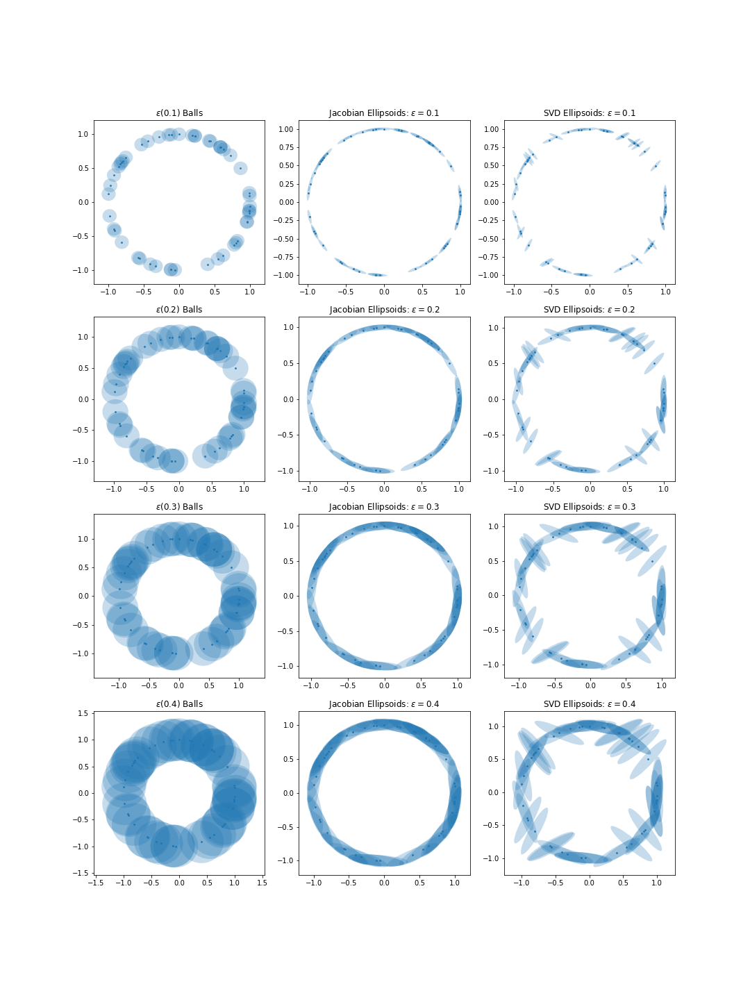

# computational-topology

Various scripts and notebooks related to computing and visualizing Persistent Homology.

Givent two datasets how can you tell if they are similar? 

<iframe src="images/two_samples.html" style=" width:100%; height:550px;"></iframe>

Linear regression gives nearly the same result but for two very different datasets, a normally distributed blob of points, and a torus, but they have very different structure.

## Filtration Examples

Compare the persistence of Homology groups for each type of filtration.